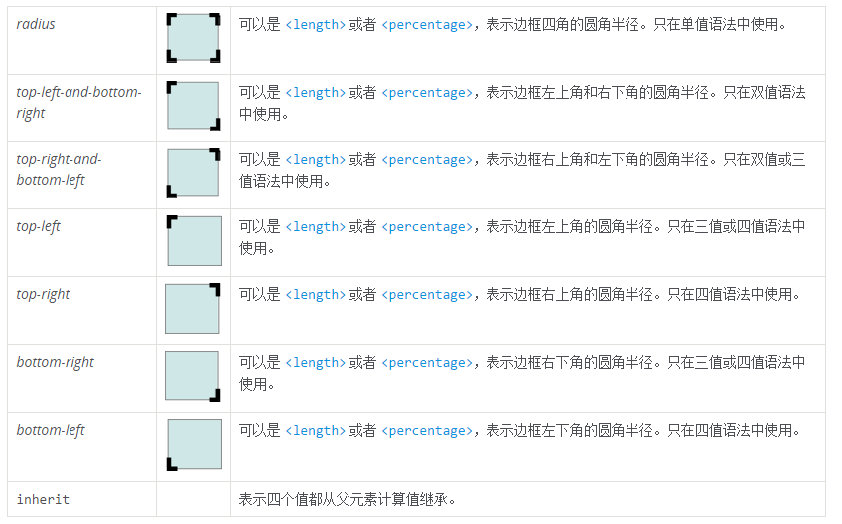
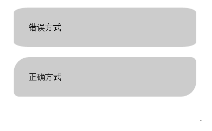

#CSS3功能推荐及优化

## border-radius
border-radius 用来设置边框圆角。当使用一个半径时确定一个圆形；当使用两个半径时确定一个椭圆，这个(椭)圆与边框的交集形成圆角效果。


这是一个简写属性，用来设置 border-top-left-radius, border-top-right-radius, border-bottom-right-radius ，border-bottom-left-radius。

和其他简写属性类似，无法为个别值设定为继承，如 border-radius:0 0 inherit inherit，这会覆盖一部分现有定义。在这种情况下只能使用完整属性来指定。

####语法
```
Formal syntax: [ <length> | <percentage> ]{1,4} [ / [ <length> | <percentage> ]{1,4} ]?

半径的第一个语法取值可取1~4个值:
border-radius: radius             
border-radius: top-left-and-bottom-right top-right-and-bottom-left 
border-radius: top-left top-right-and-bottom-left bottom-right 
border-radius: top-left top-right bottom-right bottom-left 

半径的第二个语法取值也可取1~4个值
border-radius: (first radius values) / radius             
border-radius: (first radius values) / top-left-and-bottom-right top-right-and-bottom-left 
border-radius: (first radius values) / top-left top-right-and-bottom-left bottom-right 
border-radius: (first radius values) / top-left top-right bottom-right bottom-left 

border-radius: inherit
```

####属性值



####兼容性


####注意css的书写顺序

```css
	  #wrongway { 
	    border-radius: 30px 10px;
	    -webkit-border-radius: 30px 10px;
	  }
	  #rightway { 
	    -webkit-border-radius: 30px 10px;
	    border-radius: 30px 10px;
	  }
```



如果浏览器支持不同前缀的写法，就会产生样式重写。webkit核心的浏览器不仅支持border-radius属性，也支持-webkit-border-radius属性，所以产生了以上问题。

无前缀写法(border-radius)，是让box左上角和右下角为30像素圆弧，左下角和右上是10像素圆弧。

webkit前缀写法(-webkit-border-radius)，则让box渲染为每个角都是30像素宽10像素高的圆弧。

CSS3中的background-image 渐变貌似也有同样的遭遇

## box-shadow
box-shadow 以逗号分割列表来描述一个或多个阴影效果，可以用到几乎任何元素上。如果元素同时设置了border-radius，阴影也会有圆角效果。多个阴影的z-ordering 和多个text shadows规则相同（第一个阴影在最上面）。

box-shadow是少有的几个可以省略前缀的CSS3属性，类似的还有box-shadow。不过遗憾的是，暂时移动端只有iOS支持，android是否可以用滤镜或其他方式实现有待进一步研究，见下面的兼容性表。

####语法
```
none | [inset? && [ <offset-x> <offset-y> <blur-radius>? <spread-radius>? <color>? ] ]#
```

```
/* offset-x | offset-y | color */
box-shadow: 60px -16px teal;

/* offset-x | offset-y | blur-radius | color */
box-shadow: 10px 5px 5px black;

/* offset-x | offset-y | blur-radius | spread-radius | color */
box-shadow: 2px 2px 2px 1px rgba(0, 0, 0, 0.2);

/* inset | offset-x | offset-y | color */
box-shadow: inset 5em 1em gold;

/* Any number of shadows, separated by commas */
box-shadow: 3px 3px red, -1em 0 0.4em olive;
```

`inset`
默认阴影在边框外。使用inset后，阴影在边框内（即使是透明边框），背景之上内容之下。

`<offset-x> <offset-y>`
length值，用来设置阴影偏移量。`<offset-x>` 设置水平偏移量，如果是负值则阴影位于元素左边。 `<offset-y>` 设置垂直偏移量，如果是负值则阴影位于元素上面。
如果两者都是0，那么阴影位于元素后面。这时如果设置了`<blur-radius>` 或`<spread-radius>` 则有模糊效果。

`<blur-radius>`
length值，值越大，糊糊面积越大，阴影就越大越淡。 不能为负值。默认为0，此时阴影边缘锐利。

`<spread-radius>`
length值。取正值时，阴影扩大；取负值时，阴影.收缩。默认为0，此时阴影与元素同样大。

`<color>`
如果没有指定，则由浏览器决定——通常是color的值，不过目前Safari取透明。

####兼容性


## text-shadow

text-shadow 为文字添加阴影。可以为文字与  text-decorations  添加多个阴影，阴影值之间用逗号隔开。

每个阴影指定相对文字的偏移量，可选的颜色及模糊半径。多个阴影从前往后叠加，第一个阴影在最前面。

移动端暂时均未支持。

####语法
`text-shadow: offset-x offset-y blur-radius color;`

`<color>`
可选。如果想让各浏览器保持一致，则应指定颜色

`<offset-x> <offset-y>`
必选。这些长度值指定阴影相对文字的偏移量。`<offset-x>` 指定水平偏移量，若是负值则阴影位于文字左边。 `<offset-y>` 指定垂直偏移量，若是负值则阴影位于文字上面。如果两者均为0，则阴影位于文字后面（如果设定了`<blur-radius>` 则会有模糊效果)。

`<blur-radius>`
可选。length值。如果没有指定则为0。值越大，模糊半径越大，阴影也就越大越淡。

## multiple backgrounds

Background属性在CSS3样式中已经彻底改革，开始支持多背景图片。对不支持的浏览器确认使用了备用图片，否则，它将跳此属性，使背景图像留空。

```
.multi_bg_example {
  background-image   : url(https://mdn.mozillademos.org/files/11305/firefox.png),
                       url(https://mdn.mozillademos.org/files/11307/bubbles.png),
                       linear-gradient(to right, rgba(30, 75, 115, 1),  rgba(255, 255, 255, 0));

  background-repeat  : no-repeat,
                       no-repeat,
                       no-repeat;

  background-position: bottom right,
                       left,
                       right;
}
```

Demo中的多背景分别为Firefox的logo，气泡背景图，颜色渐变，多背景的设置用逗号分隔。

####兼容性
[Here](http://caniuse.com/#feat=multibackgrounds) 

## background-size

####语法
`background-size: length|percentage|cover|contain;`
```
length	
设置背景图像的高度和宽度。第一个值设置宽度，第二个值设置高度。如果只设置一个值，则第二个值会被设置为 "auto"。

percentage	
以父元素的百分比来设置背景图像的宽度和高度。第一个值设置宽度，第二个值设置高度。如果只设置一个值，则第二个值会被设置为 "auto"。

cover	
把背景图像扩展至足够大，以使背景图像完全覆盖背景区域。背景图像的某些部分也许无法显示在背景定位区域中。

contain	
把图像图像扩展至最大尺寸，以使其宽度和高度完全适应内容区域。
```
####兼容性
[Here](http://caniuse.com/#search=background-size) 

## text-overflow
text-overflow 属性用于决定溢出的内容以何种形式提醒用户。它可以直接剪切（clipped），也可以显示一个省略号（ '…'），或者显示一个自定义的字符串(只有firefox支持)。 

####兼容性


[Here](http://caniuse.com/#search=text-overflow)

## opacity
透明opacity也可以使用rgba来实现。
```
{
    background-color:#000;
    opacity:0.6;
}
或者
{
    background-color:rgba(0, 0, 0, 0.6);
    opacity:0.6;
}
```

####使用建议
- 浏览器的某些组件无法满足UI效果时，可以将组件隐藏，比如说select，input[file]等
- 错误提示和微信分享等半透明的遮罩层；

## transform
transform 属性允许你修改CSS可视化模型的坐标控件。使用transform，元素可以按照设定的值变形、旋转、缩放、倾斜，即向元素进行2D和3D转换。与transition结合就可以实现很多CSS3动画。

####2D转换
transform 2D的主要方法有：translate()，rotate()，scale()，skew()，matrix()。

- translate() 方法
通过 translate() 方法，元素从其当前位置移动，根据给定的 left（x 坐标） 和 top（y 坐标） 位置参数：
```
div
{
    /*把元素从左侧移动 50 像素，从顶端移动 100 像素*/
    -webkit-transform: translate(50px,100px);	/* Safari and Chrome */
    -ms-transform: translate(50px,100px);		/* IE 9 */
    -o-transform: translate(50px,100px);		/* Opera */
    -moz-transform: translate(50px,100px);		/* Firefox */
    transform: translate(50px,100px);
}
```

- rotate() 方法
通过 rotate() 方法，元素顺时针旋转给定的角度。允许负值，元素将逆时针旋转。
```
div
{
    /*把元素顺时针旋转 30 度*/
    -webkit-transform: rotate(30deg);	/* Safari and Chrome */
    -ms-transform: rotate(30deg);		/* IE 9 */
    -o-transform: rotate(30deg);		/* Opera */
    -moz-transform: rotate(30deg);		/* Firefox */
    transform: rotate(30deg);
}
```
- scale() 方法
通过 scale() 方法，元素的尺寸会增加或减少，根据给定的宽度（X 轴）和高度（Y 轴）参数：
```
div
{
    /*把宽度转换为原始尺寸的 2 倍，把高度转换为原始高度的 4 倍*/
    -webkit-transform: scale(2,4);	/* Safari 和 Chrome */
    -ms-transform: scale(2,4);	/* IE 9 */
    -o-transform: scale(2,4);	/* Opera */
    -moz-transform: scale(2,4);	/* Firefox */
    transform: scale(2,4);
}
```
#### 优化建议
- 使用CSS 3D加速，-webkit-transform:transition3d和-webkit-transform:translateZ为了渲染3D样式，但我们设置值为0后，并没有真正使用3D效果，但浏览器却因此开启了GPU硬件加速模式。

```
transform: rotateZ(-180deg) translate3D(0,0,0);
```

## transition

CSS 过渡（transition）, 是 CSS3 规范的一部分,可以让属性的变化过程持续一段时间，而不是立即生效，将按一个曲线速率变化，这个过程是可以自定义。比如，将元素的高度从0%变为100%，将元素的颜色由白色变为黑色等。

通常将两个状态之间的过渡称为隐式过渡 implicit transitions ，因为开始与结束之间的状态由浏览器自行决定。

过渡可以决定哪些属性发生动画效果 (明确地列出这些属性)，何时开始 (设置 delay), 持续多久 (设置 duration) 以及如何动画 (定义timing函数，比如匀速地或先快后慢)。

#### 语法：
transition是简写属性，有以下四个属性值：

```
    transition ： [<'transition-property'> || <'transition-duration'> || <'transition-timing-function'> || <'transition-delay'> [, [<'transition-property'> || <'transition-duration'> || <'transition-timing-function'> || <'transition-delay'>]]*
```
```
    伪css：
    div {
        transition: <property> <duration> <timing-function> <delay>;
    }
```

- transition-property：执行变换的属性
    - 当其值为none时，transition马上停止执行
    - 当指定为all时，则元素产生任何属性值变化时都将执行transition效果
    - ident是可以指定元素的某一个属性值。其对应的类型：color(background-color,border-color,color等),length(width,height,top,padding,margin等)和transform等
- transition-duration：变换持续的时间
- transition-timing-function：在延续时间段，变换的速率变化
    - 可用属性: 
    `ease | linear | ease-in | ease-out | ease-in-out | cubic-bezier(<number>, <number>, <number>, <number>)`
    
    

    - cubic-bezier为通过贝赛尔曲线来计算“转换”过程中的属性值
- transition-delay：变换延迟时间
    - 当改变元素属性值后多长时间开始执行transition效果
    - 改变多个css属性的transition效果，可以有各自不同的延续时间和其时间的速率变换方式；
    - transition-delay与transition-duration的值都是时间，所以要区分它们在连写中的位置，一般浏览器会根据先后顺序决定，transition-duration | transition-delay；
    
#### 相关事件

检测过渡是否完成，在符合标准的浏览器下，这个事件是 transitionend, 在 WebKit 下是 webkitTransitionEnd。

- propertyName: 字符串，指示已完成过渡的属性。
- elapsedTime: 浮点数，指示当触发这个事件时过渡已运行的时间（秒）。这个值不受 transition-delay 影响。
- 如果取消了过渡则不会触发 transitionend 事件。

#### 注意事项：

- 目前，各大浏览器（包括IE 10）都已经支持无前缀的transition，所以transition已经可以很安全地不加浏览器前缀。兼容性表格如下：

- 不是所有的CSS属性都支持transition，完整的列表查看[这里](http://oli.jp/2010/css-animatable-properties/)，以及具体的效果。
- transition需要明确知道，开始状态和结束状态的具体数值，才能计算出中间状态。比如，height从0px变化到100px，transition可以算出中间状态。但是，transition没法算出0px到auto的中间状态，也就是说，如果开始或结束的设置是height: auto，那么就不会产生动画效果。类似的情况还有，display: none到block，background: url(foo.jpg)到url(bar.jpg)等等。
- 同时应当留意这种情形，在插入元素（如 .appendChild()）或改变属性 display: none 后立即使用过渡, 元素将视为没有开始状态，始终处于结束状态。简单的解决办法，改变属性前用 window.setTimeout() 延迟几毫秒。
- 如果发现过渡效果不顺畅，可以尝试使用setTimeout延迟改变元素的CSS属性（比如使用增减class来改变CSS属性的情况）。

#### 局限：
transition的优点在于简单易用，但是它有几个很大的局限。

- transition需要事件触发，所以没法在网页加载时自动发生。
- transition是一次性的，不能重复发生，除非一再触发，请使用animation。
- transition只能定义开始状态和结束状态，不能定义中间状态，也就是说只有两个状态。CSS的animation可以解决这个问题，能够指定动画的多个中间状态。

## animation

## Flexible Box Model

##更多资料
- 本文内容多数引用 [CSS | MDN](https://developer.mozilla.org/zh-CN/docs/Web/CSS)


=============
[@bryan](https://github.com/saviroyu)
