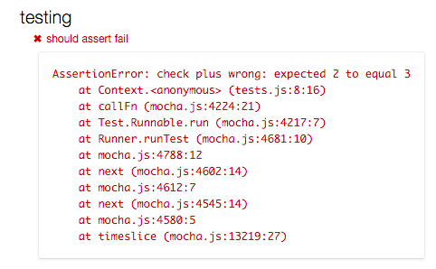
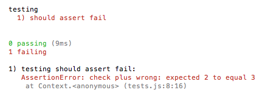

Web/JS测试框架推荐
=============

在计算机编程中，单元测试（又称为模块测试, Unit Testing）是针对程序模块（软件设计的最小单位）来进行正确性检验的测试工作。
程序单元是应用的最小可测试部件。在过程化编程中，一个单元就是单个程序、函数、过程等；
对于面向对象编程，最小单元就是方法，包括基类（超类）、抽象类、或者派生类（子类）中的方法。

每个理想的测试案例独立于其它案例；为测试时隔离模块，经常使用stubs、mock或fake等测试马甲程序。
单元测试通常由软件开发人员编写，用于确保他们所写的代码符合软件需求和遵循开发目标。
它的实施方式可以是非常手动的（通过纸笔），或者是做成构建自动化的一部分。

目标：单元测试的目标是隔离程序部件并证明这些单个部件是正确的。
一个单元测试提供了代码片断需要满足的严密的书面规约。
因此，单元测试带来了一些益处。 单元测试在软件开发过程的早期就能发现问题。

单元测试的框架推荐使用Jasmine或Mochajs，他们都有着完善的文档与成熟的社区支持。本文中将以Mochajs为例。

## 安装

首先我们需要安装Mochajs与Chai（Chai是一个BDD/TDD的断言库，Mocha没有内建的相关支持，所以通常一起使用）

1. 此处假设已经准备好了node与npm环境，具体安装方式查看[Nodejs官网](https://nodejs.org/)
2. 全局安装mocha `npm install -g mocha`
3. 初始化mocha目录 `mocha init test/`
4. 安装chai `npm install chai --save-dev`
5. 在生成的 `test/` 目录下添加chai
    - 浏览器方式：编辑 `test/index.html`, 在 `mocha.js` 的script标签后添加chai.js:
        ```html
        <script src="../node_modules/chai/chai.js"></script>
        ```

        注意node_modules的具体所在目录，应是能静态访问的目录，有必要的话将该文件拷备出来

    - 终端运行方式：编辑 `test/tests.js`， 在开头添加
        ```javascript
        if(typeof require!="undefined" && !require.amd){
            var chai = require("chai");
        }
        ```


## 开始测试

以上的安装完成后，我们就可以在 `test/tests.js` 中添加测试案例


### 写一个失败的案例

在tests.js中添加如下代码:

```javascript
var assert = chai.assert;
describe("start testing", function(){
    it("should assert fail", function(){
        assert.equal(1+1 , 3, "check plus wrong");
    });
});
```

访问`[your base url]/test/`路径，就将会执行测试。

显然，1+1不等于3，于是访问test页面会返回以下错误信息:



同时，也可以在终端中直接测试：

```bash
$ mocha tests.js
```
将返回如下结果：




---

未完待续

[@watert](https://github.com/watert/)
